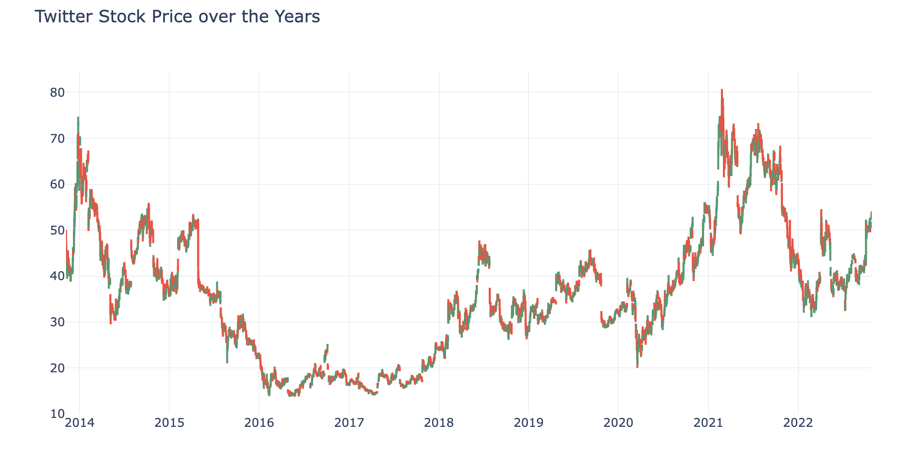
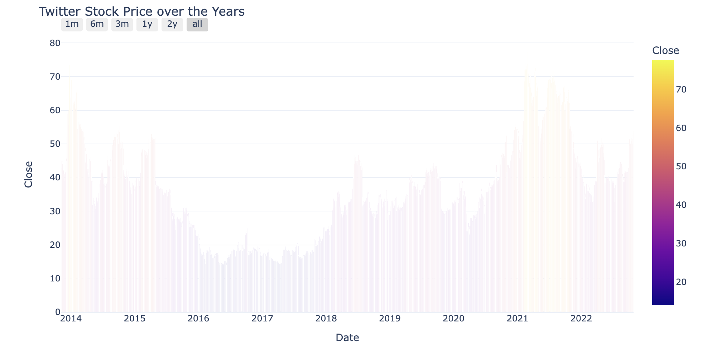
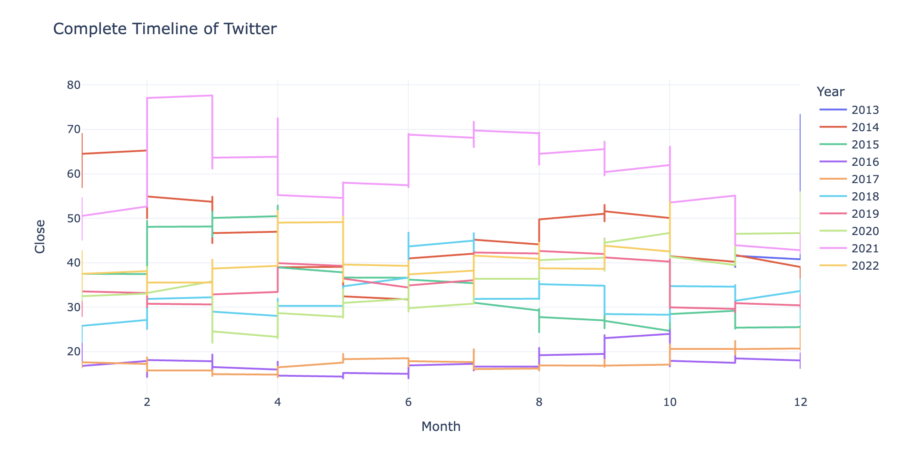

# Twitter Stock Analysis (2013 - 2022)


```py
# imports

import pandas as pd
from datetime import date, timedelta
import plotly.graph_objects as go
import plotly.express as px
import plotly.io as pio


pio.templates.default = 'plotly_white'
```

```py
# data

data = pd.read_csv('./data/TWTR.csv')
data.head()
```

|     |    Date    |   Open    |   High    |    Low    |   Close   | Adj Close |   Volume    |
| :-: | :--------: | :-------: | :-------: | :-------: | :-------: | :-------: | :---------: |
|  0  | 2013-11-07 | 45.099998 | 50.090000 | 44.000000 | 44.900002 | 44.900002 | 117701670.0 |
|  1  | 2013-11-08 | 45.930000 | 46.939999 | 40.685001 | 41.650002 | 41.650002 | 27925307.0  |
|  2  | 2013-11-11 | 40.500000 | 43.000000 | 39.400002 | 42.900002 | 42.900002 | 16113941.0  |
|  3  | 2013-11-12 | 43.660000 | 43.779999 | 41.830002 | 41.900002 | 41.900002 |  6316755.0  |
|  4  | 2013-11-13 | 41.029999 | 42.869999 | 40.759998 | 42.599998 | 42.599998 |  8688325.0  |

## Data Information

The dataset contains data about twitter stock and data contain following information

|     | Information                                  |
| --- | -------------------------------------------- |
| 1   | Date                                         |
| 2   | The opening Price of the day                 |
| 3   | The highest price of the day                 |
| 4   | The lowest price of the day                  |
| 5   | The closing price of the day                 |
| 6   | The adjusted closing price of the day        |
| 7   | The total number of shares traded in the day |

```py
data.info()
data.isnull().sum()
data = data.dropna()
figure = go.Figure(data=[go.Candlestick(x=data['Date'],
open=data['Open'],
high=data['High'],
low=data['Low'],
close=data['Close'])])

figure.update_layout(title='Twitter Stock Price over the Years', xaxis_rangeslider_visible=False)
figure.show()
```



```py
figure = px.bar(data, x = "Date", y = "Close", color = "Close")
figure.update_xaxes(rangeslider_visible=True)
figure.update_layout(title='Twitter Stock Price over the Years', xaxis_rangeslider_visible=False)
figure.update_xaxes(
  rangeselector=dict(
    buttons=list([
    dict(count=1, label='1m', step='month', stepmode='backward'),
    dict(count=6, label='6m', step='month', stepmode='backward'),
    dict(count=3, label='3m', step='month', stepmode='backward'),
    dict(count=1, label='1y', step='year', stepmode='backward'),
    dict(count=2, label='2y', step='year', stepmode='backward'),
    dict(step='all')
    ])
  )
)
figure.show()
```



```py
data['Date'] = pd.to_datetime(data["Date"], format = '%Y-%m-%d')
data['Year'] = data['Date'].dt.year
data["Month"] = data['Date'].dt.month
fig = px.line(data, x = "Month", y = "Close", color = "Year", title='Complete Timeline of Twitter')
fig.show()
```


